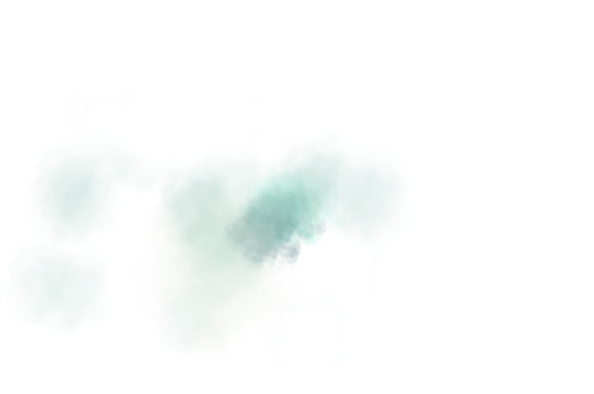
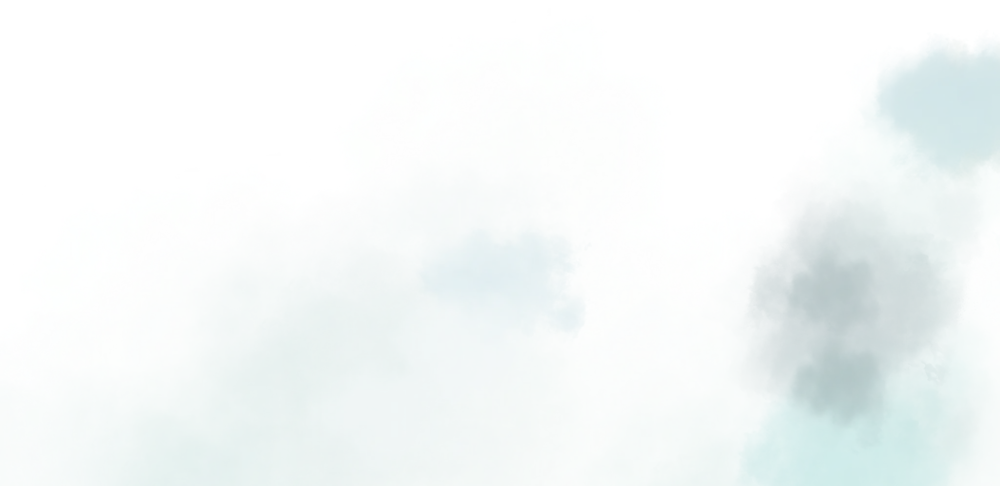

# Efeito Parallax 3D - Guia Completo para Iniciantes

**Autor:** RELVCODE
**Data:** 23 de Janeiro de 2025  
**Projeto:** Site Parallax 3D - China Zhangjiajie  

---

## 📚 Índice

1. [Introdução](#introdução)
2. [O que é o Efeito Parallax?](#o-que-é-o-efeito-parallax)
3. [Teoria e Fundamentos](#teoria-e-fundamentos)
4. [Matemática por Trás do Efeito](#matemática-por-trás-do-efeito)
5. [Estrutura do Projeto](#estrutura-do-projeto)
6. [HTML - A Base](#html---a-base)
7. [CSS - O Visual](#css---o-visual)
8. [JavaScript - A Magia](#javascript---a-magia)
9. [Responsividade](#responsividade)
10. [Otimizações de Performance](#otimizações-de-performance)
11. [Troubleshooting](#troubleshooting)
12. [Conclusão](#conclusão)

---

## 🎯 Introdução

Imagine que você está olhando pela janela de um trem em movimento. Você percebe que as montanhas distantes parecem se mover mais devagar que as árvores próximas, certo? Esse fenômeno natural é chamado de **parallax**, e é exatamente isso que vamos recriar no nosso site!

Neste guia, você vai aprender a criar um efeito parallax 3D incrível que faz as imagens se moverem em velocidades diferentes quando você move o mouse, criando uma sensação real de profundidade e imersão. É como se você pudesse "entrar" na tela!

### Por que este projeto é especial?

Este não é apenas mais um tutorial de parallax. Aqui você vai aprender:

- **A teoria por trás do efeito** - entender o "porquê" antes do "como"
- **Matemática simples** - os cálculos explicados de forma que qualquer pessoa entenda
- **Código limpo e organizado** - seguindo as melhores práticas
- **Responsividade completa** - funcionando perfeitamente em todos os dispositivos
- **Otimizações de performance** - para um site rápido e fluido

---

## 🌟 O que é o Efeito Parallax?

### Definição Simples

O **parallax** é um fenômeno visual onde objetos em diferentes distâncias parecem se mover em velocidades diferentes quando observados de um ponto em movimento. É como se você estivesse olhando através de várias camadas transparentes, cada uma se movendo em sua própria velocidade.

### Na Natureza

Pense em quando você está dirigindo na estrada:
- **Montanhas distantes**: Parecem quase paradas
- **Árvores médias**: Se movem em velocidade moderada  
- **Postes próximos**: Passam voando pela janela

### No Nosso Site

Vamos recriar essa sensação usando:
- **Imagens de fundo**: Se movem devagar (montanhas distantes)
- **Imagens do meio**: Se movem em velocidade média (névoa, montanhas médias)
- **Imagens da frente**: Se movem rapidamente (elementos próximos)

### O Resultado Final

Quando você move o mouse pela tela, cada camada de imagem se move em uma velocidade diferente, criando uma ilusão perfeita de profundidade 3D. É como se você pudesse "olhar ao redor" da paisagem!

---


## 🧠 Teoria e Fundamentos

### Como Nossos Olhos Percebem Profundidade

Para entender como criar o efeito parallax, primeiro precisamos entender como nossos olhos funcionam. Nosso cérebro usa várias "pistas" para determinar a distância dos objetos:

#### 1. **Parallax de Movimento**
Quando movemos a cabeça, objetos próximos parecem se mover mais que objetos distantes. É exatamente isso que vamos simular com o mouse!

#### 2. **Sobreposição**
Objetos que estão na frente cobrem parcialmente objetos que estão atrás. No nosso site, as montanhas da frente vão cobrir as montanhas do fundo.

#### 3. **Perspectiva Atmosférica**
Objetos distantes ficam mais "desbotados" e azulados devido à atmosfera. Por isso usamos névoa nas imagens!

#### 4. **Tamanho Relativo**
Objetos próximos parecem maiores que objetos distantes do mesmo tamanho real.

### Simulando Profundidade na Tela

Como uma tela de computador é plana (2D), precisamos "enganar" o cérebro usando truques visuais:

#### **Camadas (Z-Index)**
Organizamos as imagens em camadas, como se fossem folhas de papel transparente empilhadas:
- **Camada 1**: Fundo (z-index: 1)
- **Camada 2**: Névoa distante (z-index: 2)  
- **Camada 3**: Montanhas distantes (z-index: 3)
- **...**
- **Camada 21**: Elementos da frente (z-index: 21)

#### **Velocidades Diferentes**
Cada camada se move em uma velocidade diferente quando o mouse se move:
- **Fundo**: Velocidade -3 (move devagar, direção oposta)
- **Meio**: Velocidade 0 a 10 (movimento gradual)
- **Frente**: Velocidade 15+ (movimento rápido, mesma direção)

### A Fórmula Mágica

A base de todo o efeito está nesta fórmula simples:

```
movimento = (posição_do_mouse × velocidade_da_camada) ÷ 250
```

Vamos quebrar isso:
- **posição_do_mouse**: Onde o mouse está na tela
- **velocidade_da_camada**: O valor `data-value` de cada imagem
- **÷ 250**: Um "amortecedor" para deixar o movimento suave

### Exemplo Prático

Imagine que o mouse está na posição X = 500 pixels:

- **Fundo (data-value="-3")**: movimento = (500 × -3) ÷ 250 = -6 pixels
- **Meio (data-value="5")**: movimento = (500 × 5) ÷ 250 = 10 pixels  
- **Frente (data-value="15")**: movimento = (500 × 15) ÷ 250 = 30 pixels

Resultado: O fundo se move 6 pixels para a esquerda, o meio 10 pixels para a direita, e a frente 30 pixels para a direita. Isso cria a ilusão perfeita de profundidade!

---

## 🔢 Matemática por Trás do Efeito

### Não Tenha Medo da Matemática!

A matemática do parallax é surpreendentemente simples. Vamos explicar cada conceito como se você fosse uma criança de 12 anos:

### 1. **Sistema de Coordenadas**

Imagine a tela como um mapa:
- **X = 0**: Lado esquerdo da tela
- **X = largura da tela**: Lado direito da tela
- **Y = 0**: Topo da tela  
- **Y = altura da tela**: Fundo da tela

### 2. **Encontrando o Centro**

Para criar o efeito, precisamos saber onde está o centro da tela:

```javascript
const centerX = window.innerWidth / 2;   // Meio horizontal
const centerY = window.innerHeight / 2;  // Meio vertical
```

**Exemplo**: Se a tela tem 1024 pixels de largura:
- Centro X = 1024 ÷ 2 = 512 pixels

### 3. **Calculando a Diferença**

Agora calculamos o quanto o mouse está longe do centro:

```javascript
const deltaX = mouseX - centerX;  // Diferença horizontal
const deltaY = mouseY - centerY;  // Diferença vertical
```

**Exemplo**: Se o mouse está na posição 700 e o centro é 512:
- Delta X = 700 - 512 = 188 pixels (mouse está 188 pixels à direita do centro)

### 4. **Aplicando a Velocidade**

Cada imagem tem uma "velocidade" (data-value). Multiplicamos a diferença pela velocidade:

```javascript
const moveX = deltaX * speed / 250;
const moveY = deltaY * speed / 250;
```

**Por que dividir por 250?**
É um número que descobrimos por tentativa e erro. Ele deixa o movimento suave e natural. Você pode experimentar outros valores!

### 5. **Tabela de Velocidades**

| Camada | Data-Value | Comportamento |
|--------|------------|---------------|
| Fundo | -3 | Move devagar, direção oposta |
| Névoa distante | -2 | Move muito devagar, direção oposta |
| Montanha distante | -1 | Move pouquíssimo, direção oposta |
| Texto | 0 | Não se move (fixo) |
| Montanha próxima | 5 | Move moderadamente, mesma direção |
| Névoa próxima | 10 | Move rapidamente, mesma direção |
| Elemento frontal | 15 | Move muito rápido, mesma direção |

### 6. **Exemplo Completo de Cálculo**

Vamos simular o mouse na posição (800, 300) em uma tela 1024x768:

**Passo 1**: Encontrar o centro
- Centro X = 1024 ÷ 2 = 512
- Centro Y = 768 ÷ 2 = 384

**Passo 2**: Calcular diferenças
- Delta X = 800 - 512 = 288 pixels
- Delta Y = 300 - 384 = -84 pixels

**Passo 3**: Aplicar para cada camada

| Camada | Data-Value | Movimento X | Movimento Y |
|--------|------------|-------------|-------------|
| Fundo | -3 | (288 × -3) ÷ 250 = -3.46px | (-84 × -3) ÷ 250 = 1.01px |
| Meio | 5 | (288 × 5) ÷ 250 = 5.76px | (-84 × 5) ÷ 250 = -1.68px |
| Frente | 15 | (288 × 15) ÷ 250 = 17.28px | (-84 × 15) ÷ 250 = -5.04px |

**Resultado**: Cada camada se move uma quantidade diferente, criando o efeito 3D!

---


## 📁 Estrutura do Projeto

### Organização dos Arquivos

Um projeto bem organizado é meio caminho andado para o sucesso! Vamos ver como nossos arquivos estão estruturados:

```
parallax-video-project/
├── index.html          # Página principal
├── css/
│   └── style.css       # Estilos e posicionamento
├── js/
│   └── app.js          # Lógica do parallax
└── img/
    ├── background.png  # Fundo principal
    ├── fog_1.png       # Névoas (7 camadas)
    ├── fog_2.png
    ├── ...
    ├── mountain_1.png  # Montanhas (10 camadas)
    ├── mountain_2.png
    ├── ...
    ├── sun_rays.png    # Raios de sol
    └── black_shadow.png # Sombra
```

### Por que Separar em Pastas?

**Organização**: Cada tipo de arquivo fica em sua pasta
**Manutenção**: Fácil de encontrar e editar
**Performance**: O navegador pode cachear melhor
**Colaboração**: Outros desenvolvedores entendem rapidamente

### Convenção de Nomes

Seguimos um padrão claro para nomear as imagens:
- **background.png**: Fundo principal
- **fog_X.png**: Camadas de névoa (X = número da camada)
- **mountain_X.png**: Camadas de montanhas (X = número da camada)
- **sun_rays.png**: Efeito especial de raios solares
- **black_shadow.png**: Sombra para criar profundidade

---

## 🏗️ HTML - A Base

### Estrutura Básica

O HTML é como o esqueleto do nosso site. Vamos analisar cada parte:

```html
<!DOCTYPE html>
<html lang="pt-br">
<head>
    <meta charset="UTF-8">
    <meta name="viewport" content="width=device-width, initial-scale=1.0">
    <title>Trimendisional</title>
    <link rel="stylesheet" href="css/style.css">
</head>
<body>
    <!-- Conteúdo aqui -->
    <script src="js/app.js"></script>
</body>
</html>
```

### Header - A Navegação

```html
<header>
    <nav>
        <h1 class="logo">RELVCODE</h1>
        <ul>
            <li><a href="#">LOGIN</a></li>
            <li><a href="#">SIGN UP</a></li>
            <li class="search">
                <a href="#"><i class="fa-solid fa-magnifying-glass"></i></a>
            </li>
        </ul>
    </nav>
</header>
```

**Explicação**:
- **header**: Container fixo no topo
- **nav**: Elemento semântico para navegação
- **logo**: Nome da marca/empresa
- **ul/li**: Lista de links de navegação
- **Font Awesome**: Ícones bonitos (lupa de pesquisa)

### Main - O Coração do Parallax

```html
<main>
    <!-- Camadas do fundo para frente -->
    
    
    
    
    <!-- Texto central -->
    <div class="text">
        <h2>China</h2>
        <h1>Zhangjiajie</h1>
    </div>
    
    <!-- Mais camadas... -->
    
    
</main>
```

### A Importância da Ordem

**ATENÇÃO**: A ordem das imagens no HTML é CRUCIAL! Elas devem estar organizadas do fundo para a frente:

1. **background.png** (mais distante)
2. **fog_7.png** (névoa distante)
3. **mountain_10.png** (montanha distante)
4. **...** (camadas intermediárias)
5. **fog_1.png** (névoa próxima - mais próxima)

### Atributos Especiais

#### **class="parallax"**
Marca que esta imagem participa do efeito parallax. O JavaScript vai procurar por todos os elementos com esta classe.

#### **data-value**
Este é o "coração" do efeito! Define a velocidade e direção do movimento:
- **Valores negativos (-3, -2, -1)**: Movimento na direção oposta (fundo)
- **Valor zero (0)**: Não se move (texto fixo)
- **Valores positivos (1, 2, 3...)**: Movimento na mesma direção (frente)

#### **Nomes de Classes Descritivos**
- **bg-img**: Background image (imagem de fundo)
- **fog-7**: Fog layer 7 (camada de névoa 7)
- **mountain-10**: Mountain layer 10 (camada de montanha 10)

### Texto Central

```html
<div class="text">
    <h2>China</h2>
    <h1>Zhangjiajie</h1>
</div>
```

O texto fica no meio das camadas (z-index: 9) para aparecer sobre algumas imagens mas atrás de outras, criando profundidade.

### Semântica HTML5

Usamos elementos semânticos para melhor acessibilidade e SEO:
- **header**: Cabeçalho da página
- **nav**: Navegação principal  
- **main**: Conteúdo principal
- **h1, h2**: Hierarquia de títulos

---


## 🎨 CSS - O Visual

### Reset e Configurações Básicas

```css
* {
    margin: 0;
    padding: 0;
    box-sizing: border-box;
}
```

**Por que fazer isso?**
- **margin: 0; padding: 0;**: Remove espaçamentos padrão do navegador
- **box-sizing: border-box;**: Facilita cálculos de tamanho (inclui padding e border na largura)

### Container Principal

```css
main {
    position: relative;
    width: 100%;
    height: 100vh;
    overflow: hidden;
}
```

**Explicação**:
- **position: relative**: Permite posicionamento absoluto dos filhos
- **width: 100%; height: 100vh**: Ocupa toda a tela (vh = viewport height)
- **overflow: hidden**: Esconde partes das imagens que saem da tela

### Posicionamento das Imagens

Cada imagem usa valores específicos do PDF fornecido:

```css
.bg-img {
    position: absolute;
    width: 2800px;
    top: calc(50% - 390px);
    left: calc(50% + 10px);
    z-index: 1;
    transform: translate(-50%, -50%);
}
```

**Vamos quebrar isso**:

#### **position: absolute**
Remove a imagem do fluxo normal e permite posicionamento livre.

#### **width: 2800px**
Largura fixa em pixels. Imagens grandes garantem que não apareçam bordas quando se movem.

#### **top: calc(50% - 390px)**
Posição vertical calculada:
- **50%**: Meio da tela
- **- 390px**: Ajuste fino para posicionamento perfeito

#### **left: calc(50% + 10px)**
Posição horizontal calculada:
- **50%**: Meio da tela
- **+ 10px**: Pequeno ajuste para a direita

#### **z-index: 1**
Camada de profundidade. Números maiores ficam na frente.

#### **transform: translate(-50%, -50%)**
Centraliza a imagem no ponto de referência (top/left).

### Sistema de Camadas (Z-Index)

| Elemento | Z-Index | Posição |
|----------|---------|---------|
| background.png | 1 | Mais atrás |
| fog_7.png | 2 | Névoa distante |
| mountain_10.png | 3 | Montanha distante |
| ... | ... | ... |
| text | 9 | Texto central |
| ... | ... | ... |
| fog_1.png | 21 | Mais na frente |

### Responsividade

```css
@media (max-width: 768px) {
    .bg-img {
        width: 1400px; /* Metade do tamanho original */
    }
    
    .text {
        font-size: 12vw; /* Texto maior em mobile */
    }
}
```

**Mobile First**: Reduzimos o tamanho das imagens em dispositivos móveis para melhor performance.

---

## ⚡ JavaScript - A Magia

### Estrutura Geral

```javascript
document.addEventListener('DOMContentLoaded', function() {
    // Todo o código aqui
});
```

**Por que usar DOMContentLoaded?**
Garante que o HTML foi carregado antes de executar o JavaScript.

### Selecionando Elementos

```javascript
const parallaxElements = document.querySelectorAll('.parallax');
```

**querySelectorAll('.parallax')**: Encontra TODOS os elementos com a classe "parallax".

### Função Principal do Parallax

```javascript
function parallaxEffect(e) {
    // 1. Obter posição do mouse
    const mouseX = e.clientX;
    const mouseY = e.clientY;
    
    // 2. Calcular centro da tela
    const centerX = window.innerWidth / 2;
    const centerY = window.innerHeight / 2;
    
    // 3. Calcular diferença
    const deltaX = mouseX - centerX;
    const deltaY = mouseY - centerY;
    
    // 4. Aplicar a cada elemento
    parallaxElements.forEach(element => {
        const speed = element.getAttribute('data-value');
        const moveX = deltaX * speed / 250;
        const moveY = deltaY * speed / 250;
        
        element.style.transform = 
            `translate(calc(-50% + ${moveX}px), calc(-50% + ${moveY}px))`;
    });
}
```

### Passo a Passo Detalhado

#### **1. Capturar Posição do Mouse**
```javascript
const mouseX = e.clientX; // Posição horizontal
const mouseY = e.clientY; // Posição vertical
```

**e.clientX/Y**: Coordenadas do mouse relativas à janela do navegador.

#### **2. Encontrar Centro da Tela**
```javascript
const centerX = window.innerWidth / 2;
const centerY = window.innerHeight / 2;
```

**window.innerWidth/Height**: Largura e altura da janela do navegador.

#### **3. Calcular Distância do Centro**
```javascript
const deltaX = mouseX - centerX;
const deltaY = mouseY - centerY;
```

**Resultado**:
- **Positivo**: Mouse à direita/abaixo do centro
- **Negativo**: Mouse à esquerda/acima do centro
- **Zero**: Mouse exatamente no centro

#### **4. Aplicar Movimento**
```javascript
parallaxElements.forEach(element => {
    const speed = element.getAttribute('data-value');
    const moveX = deltaX * speed / 250;
    const moveY = deltaY * speed / 250;
    
    element.style.transform = 
        `translate(calc(-50% + ${moveX}px), calc(-50% + ${moveY}px))`;
});
```

**forEach**: Executa a função para cada elemento parallax.
**getAttribute('data-value')**: Pega a velocidade definida no HTML.
**transform**: Aplica o movimento mantendo a centralização.

### Event Listeners

```javascript
document.addEventListener('mousemove', parallaxEffect);
document.addEventListener('mouseleave', resetParallax);
```

**mousemove**: Executa a função sempre que o mouse se move.
**mouseleave**: Reseta posições quando o mouse sai da janela.

### Otimização de Performance

```javascript
let ticking = false;

function optimizedParallaxEffect(e) {
    if (!ticking) {
        requestAnimationFrame(() => {
            parallaxEffect(e);
            ticking = false;
        });
        ticking = true;
    }
}
```

**requestAnimationFrame**: Sincroniza com a taxa de atualização da tela (60 FPS) para movimento suave.

### Detecção de Mobile

```javascript
function isMobile() {
    return window.innerWidth <= 768 || 
           /Android|webOS|iPhone|iPad|iPod|BlackBerry|IEMobile|Opera Mini/i.test(navigator.userAgent);
}

if (isMobile()) {
    // Desabilitar parallax em mobile
}
```

**Por que desabilitar em mobile?**
- **Performance**: Dispositivos móveis têm menos poder de processamento
- **Usabilidade**: Não há cursor de mouse em touch screens
- **Bateria**: Efeitos constantes consomem mais energia

---

## 📱 Responsividade

### Breakpoints

```css
/* Desktop */
@media (min-width: 769px) {
    /* Estilos para desktop */
}

/* Mobile */
@media (max-width: 768px) {
    /* Estilos para mobile */
}
```

### Ajustes para Mobile

#### **Tamanhos de Imagem**
```css
@media (max-width: 768px) {
    .bg-img { width: 1400px; } /* 50% do original */
    .mountain-10 { width: 435px; } /* 50% do original */
}
```

#### **Tipografia**
```css
.text {
    font-size: 7.5vw; /* Desktop */
}

@media (max-width: 768px) {
    .text {
        font-size: 12vw; /* Mobile - maior para legibilidade */
    }
}
```

#### **Navegação**
```css
@media (max-width: 768px) {
    .hamburguer { display: block; }
    .search { display: none; }
    nav ul li:not(.hamburguer) { display: none; }
}
```

### Unidades Responsivas

- **vw**: Viewport width (1vw = 1% da largura da tela)
- **vh**: Viewport height (1vh = 1% da altura da tela)
- **%**: Porcentagem relativa ao elemento pai
- **em**: Relativo ao tamanho da fonte do elemento
- **rem**: Relativo ao tamanho da fonte raiz

---


## ⚡ Otimizações de Performance

### Por que Performance Importa?

Um site lento frustra usuários e prejudica o SEO. Nosso efeito parallax precisa rodar a 60 FPS (frames por segundo) para parecer suave e natural.

### Técnicas Utilizadas

#### **1. RequestAnimationFrame**
```javascript
function optimizedParallaxEffect(e) {
    if (!ticking) {
        requestAnimationFrame(() => {
            parallaxEffect(e);
            ticking = false;
        });
        ticking = true;
    }
}
```

**Benefícios**:
- Sincroniza com a taxa de atualização da tela
- Pausa quando a aba não está ativa
- Reduz uso de CPU/GPU

#### **2. Transform em vez de Top/Left**
```css
/* ❌ Lento - causa reflow */
element.style.top = newY + 'px';
element.style.left = newX + 'px';

/* ✅ Rápido - usa GPU */
element.style.transform = `translate(${newX}px, ${newY}px)`;
```

**Por que transform é mais rápido?**
- Usa aceleração de hardware (GPU)
- Não afeta o layout de outros elementos
- Otimizado pelos navegadores modernos

#### **3. Will-Change (CSS)**
```css
.parallax {
    will-change: transform;
}
```

**O que faz**: Avisa ao navegador que a propriedade `transform` vai mudar, permitindo otimizações antecipadas.

#### **4. Debouncing de Eventos**
```javascript
let ticking = false;
// Evita executar a função múltiplas vezes por frame
```

### Monitoramento de Performance

#### **Console Logs**
```javascript
console.log('🎉 Efeito Parallax 3D carregado com sucesso!');
console.log('📱 Mobile detected:', isMobile());
console.log('🖼️ Total parallax elements:', parallaxElements.length);
```

#### **Performance API**
```javascript
const start = performance.now();
parallaxEffect(e);
const end = performance.now();
console.log(`Parallax execution time: ${end - start} milliseconds`);
```

---

## 🔧 Troubleshooting

### Problemas Comuns e Soluções

#### **1. Imagens não aparecem**

**Sintomas**: Tela branca ou imagens quebradas

**Possíveis causas**:
- Caminho das imagens incorreto
- Nomes de arquivo errados
- Imagens não carregadas

**Soluções**:
```javascript
// Verificar se as imagens existem
const img = new Image();
img.onload = () => console.log('Imagem carregada!');
img.onerror = () => console.error('Erro ao carregar imagem');
img.src = 'img/background.png';
```

#### **2. Efeito parallax não funciona**

**Sintomas**: Imagens não se movem com o mouse

**Verificações**:
1. JavaScript carregado?
2. Elementos têm classe "parallax"?
3. Data-values definidos?
4. Console mostra erros?

**Debug**:
```javascript
// Verificar elementos encontrados
console.log('Elementos parallax:', document.querySelectorAll('.parallax'));

// Verificar event listeners
document.addEventListener('mousemove', (e) => {
    console.log('Mouse position:', e.clientX, e.clientY);
});
```

#### **3. Performance ruim/travamentos**

**Sintomas**: Movimento irregular, site lento

**Soluções**:
- Reduzir tamanho das imagens
- Usar requestAnimationFrame
- Desabilitar em mobile
- Verificar outros scripts pesados

#### **4. Imagens desalinhadas**

**Sintomas**: Elementos fora de posição

**Verificações**:
1. Valores do CSS corretos?
2. Z-index na ordem certa?
3. Transform aplicado?

**Ferramenta de debug**:
```css
/* Adicionar bordas temporárias */
.parallax {
    border: 2px solid red;
}
```

#### **5. Responsividade quebrada**

**Sintomas**: Layout ruim em mobile

**Soluções**:
- Verificar media queries
- Testar em diferentes tamanhos
- Ajustar breakpoints

### Ferramentas de Debug

#### **DevTools do Navegador**
- **F12**: Abrir ferramentas de desenvolvedor
- **Console**: Ver erros e logs
- **Elements**: Inspecionar HTML/CSS
- **Performance**: Analisar performance

#### **Debug CSS**
```css
/* Visualizar todas as camadas */
.parallax {
    outline: 2px solid rgba(255, 0, 0, 0.5);
}

/* Mostrar z-index */
.parallax::before {
    content: attr(class);
    position: absolute;
    background: rgba(0, 0, 0, 0.8);
    color: white;
    padding: 2px 5px;
    font-size: 12px;
}
```

---

## 🎯 Conclusão

### O que Você Aprendeu

Parabéns! Você acabou de dominar um dos efeitos mais impressionantes do desenvolvimento web. Vamos recapitular o que aprendemos:

#### **Conceitos Fundamentais**
- Como nossos olhos percebem profundidade
- O que é parallax e como funciona na natureza
- Como simular 3D em uma tela 2D

#### **Matemática Aplicada**
- Sistema de coordenadas da tela
- Cálculo de diferenças e proporções
- Fórmula do movimento parallax
- Velocidades e direções

#### **Tecnologias Web**
- **HTML semântico** com data-attributes
- **CSS avançado** com positioning e transforms
- **JavaScript moderno** com event listeners e otimizações
- **Responsividade** para todos os dispositivos

#### **Boas Práticas**
- Organização de código e arquivos
- Otimizações de performance
- Debug e troubleshooting
- Acessibilidade e usabilidade

### Próximos Passos

#### **Personalizações Possíveis**
1. **Trocar as imagens**: Use suas próprias fotos
2. **Ajustar velocidades**: Experimente diferentes data-values
3. **Adicionar mais camadas**: Crie profundidade extra
4. **Mudar cores**: Customize o tema visual
5. **Adicionar animações**: CSS animations e transitions

#### **Melhorias Avançadas**
1. **Parallax com scroll**: Movimento baseado na rolagem
2. **Efeitos de partículas**: Adicionar elementos dinâmicos
3. **Integração com bibliotecas**: GSAP, Three.js
4. **Modo VR**: Parallax para realidade virtual
5. **Interações avançadas**: Click, hover, gestos

#### **Aplicações Práticas**
- **Portfólios**: Impressione recrutadores
- **Landing pages**: Aumente conversões
- **Sites de produtos**: Destaque características
- **Jogos web**: Crie cenários imersivos
- **Arte digital**: Experimente com criatividade

### Recursos para Continuar Aprendendo

#### **Documentação Oficial**
- [MDN Web Docs](https://developer.mozilla.org/) - Referência completa
- [CSS-Tricks](https://css-tricks.com/) - Tutoriais e dicas
- [JavaScript.info](https://javascript.info/) - Guia completo de JS

#### **Ferramentas Úteis**
- **CodePen**: Experimente código online
- **GitHub**: Compartilhe seus projetos
- **Figma**: Design de interfaces
- **Chrome DevTools**: Debug avançado

#### **Comunidades**
- **Stack Overflow**: Tire dúvidas
- **Reddit r/webdev**: Discussões e novidades
- **Discord/Slack**: Grupos de desenvolvedores
- **YouTube**: Tutoriais em vídeo

### Mensagem Final

O efeito parallax 3D que você criou não é apenas código - é arte digital em movimento. Você transformou matemática simples em uma experiência visual impressionante que pode emocionar e engajar usuários.

Lembre-se: todo grande desenvolvedor começou com projetos como este. Continue experimentando, quebrando coisas, consertando e aprendendo. A jornada do desenvolvimento web é infinita e sempre recompensadora.

**Agora vá lá e crie algo incrível! 🚀**

---

### Créditos e Referências

**Projeto baseado no tutorial**: "This Cool JavaScript Effect Will Make Your Website 3D!" por True Coder
**Desenvolvido por** RELVCODE
**Data**: 23 de Janeiro de 2025
**Tecnologias**: HTML5, CSS3, JavaScript ES6+

**Imagens utilizadas**: Paisagem de Zhangjiajie, China
**Fonte**: Font Awesome para ícones
**Compatibilidade**: Todos os navegadores modernos

---

*Este documento foi criado com ❤️ para ajudar desenvolvedores iniciantes a entender e dominar o efeito parallax 3D. Compartilhe o conhecimento!*

